<div align="center">


# ⚡ Batch Word → PDF Converter

### *Professional Batch Conversion with a Sleek Dark GUI*

[](https://python.org)
[](https://docs.python.org/3/library/tkinter.html)
[](https://libreoffice.org)
[](https://opensource.org/licenses/MIT)
[](http://makeapullrequest.com)

**Convert • Manage • Deliver**

[Features](#-features) • [Installation](#️-installation) • [Quick Start](#-quick-start) • [Project Structure](#-project-structure) • [Contributing](#-contributing)

</div>

## 📖 Overview

**Batch Word → PDF Converter** is a professional desktop tool for converting multiple `.doc` and `.docx` files to PDF simultaneously — all from a polished dark-themed GUI built with Python and Tkinter.

Designed for power users, developers, and anyone who regularly handles document conversion, it eliminates repetitive manual work through a clean interface, real-time progress tracking, and smart multi-engine backend detection.

<div align="center">

### 🎯 **Why This Tool?**

| **Batch Processing** | **Smart Backend** | **Live Feedback** | **Zero Lock-in** |
|:---:|:---:|:---:|:---:|
| Convert entire folders at once | Auto-detects LibreOffice, Word, or docx2pdf | Real-time log with per-file status | Free & open source, no subscriptions |

</div>

---

## ✨ Features

### ⚙️ **Multi-Engine Conversion Backend**

```mermaid
graph LR
    A[Word Files] --> B{Backend Detection}
    B -->|Best| C[LibreOffice]
    B -->|Windows| D[MS Word COM]
    B -->|Fallback| E[docx2pdf]
    C --> F[PDF Output]
    D --> F
    E --> F

    style A fill:#1c2130
    style F fill:#1a3320
```



Auto-detects the best available engine in priority order:
- **LibreOffice** — Cross-platform, fully supports Persian/RTL, recommended
- **Microsoft Word** (Windows) — Via COM automation, highest fidelity
- **docx2pdf** — Lightweight Python wrapper as fallback

### 📁 **File Management**

<table>
<tr>
<td width="50%">

#### Adding Files
- 📄 **Select Individual Files** — Multi-select `.doc` / `.docx` via file dialog
- 📂 **Scan Entire Folder** — Recursive scan of all Word files in a directory
- 🔁 **Duplicate Prevention** — Same file won't be added twice

</td>
<td width="50%">

#### Managing the List
- 🗑 **Remove Selected** — Delete one or multiple highlighted files
- 🧹 **Clear All** — Wipe the list with confirmation dialog
- ✅ **Live Status Icons** — Each file shows ⏳ → ✅ or ❌ as it converts

</td>
</tr>
</table>

### 📊 **Real-Time Progress Dashboard**

Track every conversion as it happens:

| Metric | Description |
|--------|-------------|
| **Progress Bar** | Live percentage with `current / total` counter |
| **Success Count** | Number of successfully converted files |
| **Error Count** | Files that failed, logged with reason |
| **Speed** | Conversions per second |
| **Elapsed Time** | Total time since conversion started |

### 📋 **Detailed Conversion Log**

<details>
<summary><b>Sample Log Output</b></summary>

```
[14:23:01] Conversion started: 5 files
[14:23:01] ⏳ Converting: report_q1.docx
[14:23:03] ✅ report_q1.docx  →  142 KB  (1.8s)
[14:23:03] ⏳ Converting: invoice_march.docx
[14:23:04] ✅ invoice_march.docx  →  87 KB  (0.9s)
[14:23:04] ⏳ Converting: old_format.doc
[14:23:06] ❌ old_format.doc: LibreOffice returned an error
[14:23:09] ════════════════════════════════════════
[14:23:09] Done!  Success: 4  |  Failed: 1  |  Total time: 8.1s
```

</details>

Color-coded entries: 🟢 success · 🔴 error · 🔵 info · 🟡 in-progress · ⚫ system

### 🛡 **Conflict Resolution & Safety**

- **Overwrite Mode** — Toggle to replace existing PDFs
- **Auto-Rename** — When off, saves as `file_1.pdf`, `file_2.pdf` automatically
- **Thread Safety** — Conversion runs on a background thread; UI never freezes
- **Cancel Anytime** — Stop mid-batch with instant effect

---

## 🛠️ Installation

### Prerequisites

```bash
Python: >= 3.9
LibreOffice (recommended): https://libreoffice.org/download/
```

### Automatic Setup (Recommended)

```bash
# 1. Clone the repository
git clone https://github.com/yourusername/word2pdf.git
cd word2pdf

# 2. Run the auto-installer
python setup.py
```

`setup.py` will:
- Create a Python virtual environment (`venv/`)
- Install all required packages
- Detect available conversion backends
- Generate a platform-specific run script (`run.bat` / `run.sh`)

### Manual Setup

```bash
# Create and activate virtual environment
python -m venv venv

# Windows
venv\Scripts\activate

# macOS / Linux
source venv/bin/activate

# Install dependencies
pip install -r requirements.txt

# Run
python main.py
```

<details>
<summary><b>Platform Notes</b></summary>

**Windows:**
- LibreOffice or Microsoft Word required
- For Word COM automation: `pip install pywin32`
- Run as Administrator if permission errors occur

**macOS:**
- Install LibreOffice from the official site
- May require allowing the app in Security & Privacy settings

**Linux:**
```bash
sudo apt install libreoffice   # Ubuntu/Debian
sudo dnf install libreoffice   # Fedora
```

</details>

---

## 🚀 Quick Start

### Convert Your First Batch

1. **Launch the App**
   ```bash
   python main.py
   ```

2. **Add Files**
   ```
   Click "➕ Add Files"  →  Select one or more .docx files
   — or —
   Click "📁 Add Folder"  →  All Word files will be scanned recursively
   ```

3. **Choose Output Directory**
   ```
   Click "…" next to the output path  →  Select destination folder
   ```

4. **Convert**
   ```
   Click "▶ Convert"  →  Watch the progress bar and log panel
   ```

5. **Open Results**
   ```
   Click "📂 Open Output Folder"  →  Your PDFs are ready
   ```

### Keyboard & UI Tips

| Action | How |
|--------|-----|
| Select multiple files in list | `Ctrl + Click` or `Shift + Click` |
| Remove selected files | Click 🗑 Remove button |
| Stop an ongoing conversion | Click ⏹ Stop |
| Prevent overwriting existing PDFs | Uncheck "Overwrite" box |

---

## 📂 Project Structure

```
word2pdf/
├── main.py              # Entry point — launches the app
├── setup.py             # One-command auto-installer
├── requirements.txt     # Python dependencies
├── README.md
│
├── core/
│   ├── __init__.py
│   └── converter.py     # Conversion engine (multi-backend)
│                        # ConversionResult · ConversionStats · Converter class
│
└── ui/
    ├── __init__.py
    └── app.py           # Full GUI (dark theme, all widgets)
                         # FileListPanel · ProgressPanel · LogPanel · StatusBar
```

### Architecture Overview

**`core/converter.py`**
- `detect_backend()` — Probes system for available engines
- `Converter.convert_file()` — Converts a single file, returns `ConversionResult`
- `Converter.convert_batch()` — Iterates files with start/done/finish callbacks
- Thread-safe cancellation via `threading.Event`

**`ui/app.py`**
- All UI components are self-contained classes
- Conversion runs in a `daemon` thread; callbacks use `root.after()` to safely update UI
- `RoundedButton` — Custom canvas-rendered button with hover state
- `FileListPanel` — Listbox with per-item status icons and color tagging

---

## 🐛 Troubleshooting

### Common Issues

<details>
<summary><b>No conversion engine found</b></summary>

Install LibreOffice from [libreoffice.org](https://libreoffice.org), then restart the app. The status bar in the bottom-right corner will confirm the detected engine.

</details>

<details>
<summary><b>Persian / Arabic text looks broken in output PDF</b></summary>

1. Make sure LibreOffice is the active backend (shown in status bar)
2. Verify Persian fonts are installed on your system
3. On Linux: `sudo apt install fonts-farsiweb`

</details>

<details>
<summary><b>Permission error on Windows</b></summary>

Right-click `run.bat` → **Run as Administrator**

</details>

<details>
<summary><b>Output PDF is empty or corrupt</b></summary>

- The source file may be password-protected — remove the password first
- Try opening the `.docx` in LibreOffice manually to check for issues
- Check the log panel for the specific error message

</details>

---

## 🤝 Contributing

Contributions are welcome! Here's how to get started:

```bash
# 1. Fork the repository on GitHub

# 2. Clone your fork
git clone https://github.com/YOUR_USERNAME/word2pdf.git

# 3. Create a feature branch
git checkout -b feature/your-feature-name

# 4. Make your changes and commit
git commit -m "Add: description of your change"

# 5. Push and open a Pull Request
git push origin feature/your-feature-name
```

### Areas to Contribute

| Area | Ideas |
|------|-------|
| 🔧 **Backends** | Add `unoconv` support, `wkhtmltopdf` for HTML→PDF |
| 🎨 **UI** | Drag-and-drop file support, thumbnail previews |
| 🌐 **i18n** | Add more UI language options |
| 🧪 **Tests** | Unit tests for converter core logic |
| 📖 **Docs** | More examples, video walkthrough |

---

## 📄 License

This project is licensed under the **MIT License**. See the [LICENSE](LICENSE) file for details.

---

## 🙏 Acknowledgments

<div align="center">

### Built With Na7iD & Nike

[](https://python.org)
[](https://libreoffice.org)
[](https://docs.python.org/3/library/tkinter.html)

### Special Thanks To

**LibreOffice Team** | **Python Community** | **Open Source Contributors**
:---: | :---: | :---:
Best open-source office suite | Amazing ecosystem and tooling | docx2pdf, pywin32, and more

</div>

---

<div align="center">


### ✨ **Built with ❤️ for productivity lovers** ✨

[](https://github.com/7Na7iD7)(https://github.com/nikifarzami)

</div>
