<div align="center">


# ⚡ Batch Word → PDF Converter & Compressor

### *Professional Batch Conversion & Compression with a Sleek Dark GUI*

[](https://python.org)
[](https://docs.python.org/3/library/tkinter.html)
[](https://libreoffice.org)
[](https://opensource.org/licenses/MIT)
[](http://makeapullrequest.com)

**Convert • Compress • Manage • Deliver**

[Features](#-features) • [Installation](#️-installation) • [Quick Start](#-quick-start) • [Project Structure](#-project-structure) • [Contributing](#-contributing)

</div>

---

## 📖 Overview

**Batch Word → PDF Converter & Compressor** is a professional desktop tool for converting multiple `.doc` and `.docx` files to PDF and compressing existing PDFs — all from a polished dark-themed GUI built with Python and Tkinter.

Designed for power users, developers, and anyone who regularly handles document workflows, it eliminates repetitive manual work through a clean two-tab interface, real-time progress tracking, and smart multi-engine backend detection.

<div align="center">

### 🎯 **Why This Tool?**

| **Batch Processing** | **Smart Backend** | **Live Feedback** | **Zero Lock-in** |
|:---:|:---:|:---:|:---:|
| Convert & compress entire folders at once | Auto-detects best available engine | Real-time log with per-file status | Free & open source, no subscriptions |

</div>

---

## ✨ Features

### ▶️ Tab 1 — Word → PDF Conversion

#### ⚙️ **Multi-Engine Conversion Backend**



```mermaid
graph LR
    A[Word Files] --> B{Backend Detection}
    B -->|Best| C[LibreOffice]
    B -->|Windows| D[MS Word COM]
    B -->|Fallback| E[docx2pdf]
    C --> F[PDF Output]
    D --> F
    E --> F

    style A fill:#1c2130
    style F fill:#1a3320
```

Auto-detects the best available engine in priority order:
- **LibreOffice** — Cross-platform, fully supports Persian/RTL, recommended
- **Microsoft Word** (Windows) — Via COM automation, highest fidelity
- **docx2pdf** — Lightweight Python wrapper as fallback

---

### ⚙️ Tab 2 — PDF Compressor *(New!)*

#### 🗜️ **Multi-Engine Compression Backend**

```mermaid
graph LR
    A[PDF Files] --> B{Backend Detection}
    B -->|Best| C[pikepdf]
    B -->|Fallback| D[pypdf]
    C --> E[Compressed PDF]
    D --> E

    style A fill:#1c2130
    style E fill:#331a00
```



Auto-detects the best available compression engine:
- **pikepdf** — Fast and robust, great cross-platform support, recommended
- **pypdf** — Pure-Python fallback, no extra install needed

#### 🎚️ **Quality Presets**

| Preset | DPI | Best For |
|--------|-----|----------|
| `screen` | 72 dpi | Smallest file, screen reading |
| `ebook` | 150 dpi | Balanced — default |
| `printer` | 300 dpi | High-quality print |
| `prepress` | 300 dpi | Maximum quality, press-ready |

---

### 📁 **File Management** *(both tabs)*

<table>
<tr>
<td width="50%">

#### Adding Files
- 📄 **Select Individual Files** — Multi-select via file dialog
- 📂 **Scan Entire Folder** — Recursive scan of all files in a directory
- 🔁 **Duplicate Prevention** — Same file won't be added twice

</td>
<td width="50%">

#### Managing the List
- 🗑 **Remove Last** — Remove the last file in the list
- 🧹 **Clear All** — Wipe the list with confirmation dialog
- ✅ **Live Status Icons** — Each file shows `○` → `✓` or `✗` as it processes

</td>
</tr>
</table>

### 📊 **Real-Time Progress Dashboard**

Track every operation as it happens:

| Metric | Conversion Tab | Compression Tab |
|--------|---------------|-----------------|
| **Progress Bar** | Live percentage | Live percentage |
| **Success Count** | Files converted | Files compressed |
| **Failed Count** | Failed files | Failed files |
| **Speed / Saved** | Conversions/sec | KB/MB saved |
| **Elapsed Time** | Total time | Total time |

### 📋 **Detailed Activity Log**

<details>
<summary><b>Sample Conversion Log</b></summary>

```
[14:23:01] Conversion started: 5 files
[14:23:01] Converting: report_q1.docx
[14:23:03] ✓ report_q1.docx  →  142 KB  (1.8s)
[14:23:03] Converting: invoice_march.docx
[14:23:04] ✓ invoice_march.docx  →  87 KB  (0.9s)
[14:23:04] Converting: old_format.doc
[14:23:06] ✗ old_format.doc: LibreOffice returned an error
[14:23:09] ━━━━━━━━━━━━━━━━━━━━━━━━━━━━━━━━━━━━
[14:23:09] Done!  ✓ 4  ✗ 1  |  8.1s total
```

</details>

<details>
<summary><b>Sample Compression Log</b></summary>

```
[02:21:36] Compressing 3 file(s)  [quality: ebook]
[02:21:36] Compressing: report.pdf
[02:21:37] ✓ report.pdf  5694→1823 KB  (-68%)  (0.9s)
[02:21:37] Compressing: invoice.pdf
[02:21:38] ✓ invoice.pdf  2100→980 KB  (-53%)  (0.8s)
[02:21:38] ━━━━━━━━━━━━━━━━━━━━━━━━━━━━━━━━━━━━
[02:21:38] Done!  ✓ 2  ✗ 0  |  saved 5.0 MB  |  1.7s total
```

</details>

### 🛡 **Safety & Control**

- **Overwrite Mode** — Toggle to replace existing files or auto-rename (`file_1.pdf`, `file_2.pdf`)
- **Thread Safety** — All operations run on a background thread; UI never freezes
- **Cancel Anytime** — Stop mid-batch instantly with the Stop button

---

## 🛠️ Installation

### Prerequisites

```
Python  >= 3.9
LibreOffice (for conversion):  https://libreoffice.org/download/
```

### Automatic Setup (Recommended)

```bash
# 1. Clone the repository
git clone https://github.com/yourusername/word2pdf.git
cd word2pdf

# 2. Run the auto-installer
python setup.py
```

`setup.py` will:
- Create a Python virtual environment (`venv/`)
- Install all required packages
- Detect available backends
- Generate a platform-specific run script (`run.bat` / `run.sh`)

### Manual Setup

```bash
# Create and activate virtual environment
python -m venv venv

# Windows
venv\Scripts\activate

# macOS / Linux
source venv/bin/activate

# Install dependencies
pip install -r requirements.txt

# Run
python main.py
```

### Optional — Install Compression Engines

```bash
# Option 1: pikepdf (recommended, robust)
pip install pikepdf

# Option 2: pypdf (pure Python, already included)
pip install pypdf
```

<details>
<summary><b>Platform Notes</b></summary>

**Windows:**
- LibreOffice or Microsoft Word required for conversion
- For Word COM automation: `pip install pywin32`
- Run as Administrator if permission errors occur

**macOS:**
- Install LibreOffice from the official site
- May require allowing the app in Security & Privacy settings

**Linux:**
```bash
sudo apt install libreoffice   # Ubuntu/Debian
sudo dnf install libreoffice   # Fedora
```

</details>

---

## 🚀 Quick Start

### Convert Word Files to PDF

1. **Launch the App**
   ```bash
   python main.py
   ```
2. **Select the `Word → PDF` tab**
3. **Add Files** — click `＋ Add Files` or `⊞ Add Folder`
4. **Choose Output Directory** — click `…`
5. **Click `▶ Convert`** — watch the progress bar and log

### Compress PDF Files

1. **Select the `⚙ PDF Compress` tab**
2. **Add PDFs** — click `＋ Add PDFs` or `⊞ Add Folder`
3. **Choose Quality** — `ebook` is the default balanced setting
4. **Choose Output Directory** — click `…`
5. **Click `⚙ Compress`** — compressed files saved to output folder

---

## 📂 Project Structure

```
word2pdf/
├── main.py              # Entry point — launches the app
├── setup.py             # One-command auto-installer
├── requirements.txt     # Python dependencies
├── README.md
│
├── core/
│   ├── __init__.py
│   ├── converter.py     # Conversion engine (LibreOffice / Word / docx2pdf)
│   └── compressor.py    # Compression engine (Ghostscript / pikepdf / pypdf)
│
└── ui/
    ├── __init__.py
    └── app.py           # Full GUI — dark theme, all widgets
                         # ConversionTab · CompressionTab · FileListPanel
                         # LogPanel · StatCard · AnimatedProgressBar
```

### Architecture Overview

**`core/converter.py`**
- `detect_backend()` — Probes system for available conversion engines
- `Converter.convert_file()` — Converts a single file, returns `ConversionResult`
- `Converter.convert_batch()` — Iterates files with start/done/finish callbacks

**`core/compressor.py`**
- `detect_compression_backend()` — Probes for Ghostscript, pikepdf, pypdf
- `Compressor.compress_file()` — Compresses a single PDF, returns `CompressionResult`
- `Compressor.compress_batch()` — Batch compression with live callbacks
- Quality presets: `screen / ebook / printer / prepress`

**`ui/app.py`**
- Two-tab layout: `ConversionTab` and `CompressionTab`
- All operations run in `daemon` threads; UI updates via `root.after()`
- `GlowButton` — Custom canvas-rendered button with hover & glow effect
- `FileListPanel` — Scrollable list with per-item status icons
- `AnimatedProgressBar` — Custom canvas progress bar with color support

---

## 🐛 Troubleshooting

<details>
<summary><b>No conversion engine found</b></summary>

Install LibreOffice from [libreoffice.org](https://libreoffice.org), then restart the app. The engine name shows in the top-right corner of the window.

</details>

<details>
<summary><b>Compression fails with "Page must be part of"</b></summary>

This is a `pypdf` limitation with some PDF structures. Install `pikepdf` for better compatibility:
```bash
pip install pikepdf
```
Restart the app — it will automatically use pikepdf.

</details>

<details>
<summary><b>Compression ratio is -0% (no savings)</b></summary>

The file is already optimized. Try switching to `pikepdf` if not already installed:
```bash
pip install pikepdf
```

</details>

<details>
<summary><b>Persian / Arabic text looks broken in output PDF</b></summary>

1. Make sure LibreOffice is the active backend (shown in title bar)
2. Verify Persian fonts are installed on your system
3. On Linux: `sudo apt install fonts-farsiweb`

</details>

<details>
<summary><b>Permission error on Windows</b></summary>

Right-click `run.bat` → **Run as Administrator**

</details>

<details>
<summary><b>Output PDF is empty or corrupt</b></summary>

- The source file may be password-protected — remove the password first
- Try opening the file manually in LibreOffice to verify it's valid
- Check the Activity Log for the specific error message

</details>

---

## 🤝 Contributing

Contributions are welcome! Here's how to get started:

```bash
# 1. Fork the repository on GitHub

# 2. Clone your fork
git clone https://github.com/YOUR_USERNAME/word2pdf.git

# 3. Create a feature branch
git checkout -b feature/your-feature-name

# 4. Make your changes and commit
git commit -m "Add: description of your change"

# 5. Push and open a Pull Request
git push origin feature/your-feature-name
```

### Areas to Contribute

| Area | Ideas |
|------|-------|
| 🔧 **Backends** | Add `unoconv`, `wkhtmltopdf` for HTML→PDF |
| 🗜️ **Compression** | PDF merging, splitting, watermarking |
| 🎨 **UI** | Drag-and-drop file support, thumbnail previews |
| 🌐 **i18n** | Persian UI language option |
| 🧪 **Tests** | Unit tests for converter and compressor core |
| 📖 **Docs** | More examples, video walkthrough |

---

## 📄 License

This project is licensed under the **MIT License**. See the [LICENSE](LICENSE) file for details.

---

## 🙏 Acknowledgments

<div align="center">

### Built With Na7iD & Nike

[](https://python.org)
[](https://libreoffice.org)
[](https://docs.python.org/3/library/tkinter.html)

### Special Thanks To

**LibreOffice Team** | **Python Community** | **Open Source Contributors**
:---: | :---: | :---:
Best open-source office suite | Amazing ecosystem and tooling | pikepdf, pypdf, docx2pdf, pywin32 and more

</div>

---

<div align="center">


### ✨ **Built with ❤️ for productivity lovers** ✨

[](https://github.com/7Na7iD7)
[](https://github.com/nikifarzami)

</div>
